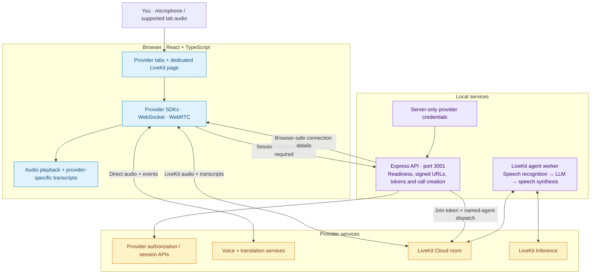

<p align="center">
  <a href="#providers"></a>
  <a href="package.json"></a>
  <a href="package.json"></a>
  <a href="package.json"></a>
  <a href="package.json"></a>
  <a href="package.json"></a>
  <a href="package.json"></a>
  <a href="LICENSE"></a>
</p>

# Voice-Agent-PuPuPlatter

**A sampler platter for voice AI.** Explore real-time conversations across providers, translate live audio, and run a LiveKit voice agent from one React application. Choose the integrations you want, bring their credentials, and switch between them in a shared interface.

[Quick start](#quick-start) · [Providers](#providers) · [Architecture](#how-it-works) · [LiveKit](#livekit-cloud-agent) · [Documentation](#documentation)

## What’s on the platter

- **Ten provider tabs:** ElevenLabs Widget and SDK, xAI Grok, OpenAI Realtime, OpenAI Translation, Ultravox, Vapi, Retell, Gemini Live, and LiveKit Cloud.
- **Live translation:** microphone or supported browser-tab audio, translated audio playback, source/translated transcripts, and Markdown export.
- **A local LiveKit agent:** a dedicated `/livekit` page with streamed transcripts, interruption support, and bounded sessions.
- **Configurable demos:** enable integrations with environment flags; mint provider credentials through an Express API where required.
- **Shareable HTTPS:** `npm run demo` builds the app and serves it through a temporary ngrok tunnel. Docker configuration is included for production-style hosting.

Features and controls vary by provider. Live conversations require configured provider accounts and available quota; tab visibility alone does not establish readiness.

## Quick start

You need **Node.js 22.22.1+**, **npm 10+**, Git, and a browser with microphone access. Voice capture needs localhost or HTTPS.

```bash
git clone --branch main https://github.com/moshehbenavraham/Voice-Agent-PuPuPlatter.git
cd Voice-Agent-PuPuPlatter
npm ci
cp .env.example .env
```

Edit `.env` before starting:

1. Set the flags for the providers you want to `true` and disable the others. The example enables several integrations and contains placeholder credentials.
2. Fill in those providers’ credentials using the [table below](#providers). You do not need accounts for every provider.
3. Keep the local defaults `VITE_API_BASE_URL=http://localhost:3001` and `CORS_ORIGIN=http://localhost:8082`.

```bash
npm run dev:all
```

Open **[localhost:8082](http://localhost:8082)**, select a configured provider, start a conversation, and allow microphone access. The Express API runs on port **3001**:

```bash
curl -fsS http://localhost:3001/api/health
```

The health response distinguishes app readiness from provider configuration. A `degraded` status can mean an unused provider is unconfigured; it does not necessarily mean the app failed to start. Configuration checks do not test upstream credentials, billing, or an actual conversation.

**Environment boundary:** `VITE_*` values are public frontend configuration. Keep secret API keys in server-only variables in the ignored `.env`. Restart development after configuration changes; rebuild production assets when changing frontend flags. See [environment configuration](docs/environments.md) for details.

## Providers

The [provider registry](src/types/voice-provider.ts) defines the ten tabs and their order. Each flag below controls frontend visibility; credentials and backend readiness are separate.

| Provider tab       | Visibility flag                   | Required configuration                                                                                           |
| ------------------ | --------------------------------- | ---------------------------------------------------------------------------------------------------------------- |
| ElevenLabs Widget  | `VITE_ELEVENLABS_ENABLED`         | `VITE_ELEVENLABS_AGENT_ID`; configure the hosted agent for widget access                                         |
| ElevenLabs SDK     | `VITE_ELEVENLABS_SDK_ENABLED`     | `VITE_ELEVENLABS_AGENT_ID` + server `ELEVENLABS_API_KEY` for signed URLs                                         |
| xAI Grok           | `VITE_XAI_ENABLED`                | Server `XAI_API_KEY`                                                                                             |
| OpenAI Realtime    | `VITE_OPENAI_ENABLED`             | Server `OPENAI_API_KEY`                                                                                          |
| OpenAI Translation | `VITE_OPENAI_TRANSLATION_ENABLED` | Server `OPENAI_API_KEY`; separate from the Realtime voice tab                                                    |
| Ultravox           | `VITE_ULTRAVOX_ENABLED`           | Server `ULTRAVOX_API_KEY`                                                                                        |
| Vapi               | `VITE_VAPI_ENABLED`               | Public `VITE_VAPI_WEB_TOKEN`; optional `VITE_VAPI_ASSISTANT_ID`                                                  |
| Retell             | `VITE_RETELL_ENABLED`             | `VITE_RETELL_AGENT_ID` + server `RETELL_API_KEY`                                                                 |
| Gemini Live        | `VITE_GEMINI_ENABLED`             | Server `GEMINI_API_KEY`                                                                                          |
| LiveKit Cloud      | `VITE_LIVEKIT_ENABLED`            | Server `LIVEKIT_ENABLED=true`, `LIVEKIT_URL`, `LIVEKIT_API_KEY`, `LIVEKIT_API_SECRET`, and a running local agent |

OpenAI Translation, Gemini Live, and LiveKit are disabled in the supplied `.env.example`. Vapi uses its public web token directly in the browser. Start with the checked-in [environment template](.env.example) for optional voices, models, prompts, and agent settings.

### Live translation

Enable `VITE_OPENAI_TRANSLATION_ENABLED=true` and set the server’s `OPENAI_API_KEY`. Choose microphone input or tab audio, select the target language, then start translation. Tab capture depends on browser support and selecting a share target with audio enabled.

Translation uses WebRTC, with a default 30-minute browser session limit and a hard 120-minute cap. Transcripts stay in current-session UI state and can be exported as Markdown; the app does not store them in a database. See the [translation guide](docs/OPENAI_TRANSLATION_DEMO.md) for setup, audio capture, limits, and troubleshooting.

### LiveKit Cloud agent

Install and build the separately packaged agent once:

```bash
npm run agent:livekit:setup
```

Configure the LiveKit variables from the table in the root `.env`, then run the worker in a second terminal alongside `npm run dev:all`:

```bash
npm run agent:livekit
```

Open **[localhost:8082/livekit](http://localhost:8082/livekit)**. The current pipeline uses Deepgram Nova-3 speech recognition, Gemma 4 31B, and Inworld TTS-2 with Ashley via LiveKit Inference. The default session cap is ten minutes. The local worker needs LiveKit project quota and stays running for the conversation; it needs no inbound tunnel. See [LiveKit setup](docs/LIVEKIT_CLOUD.md).

## How it works

The browser owns the conversation UI and connects to provider media services. Express creates signed URLs, short-lived credentials, or calls where an integration needs server authorization. LiveKit adds a separate local worker that joins its cloud room.



Vapi’s public-token flow and the hosted ElevenLabs widget do not use the same server credential flow as the other integrations. In development, Vite serves the UI on port 8082. In production and demo mode, Express also serves the built frontend from `dist/`. See the [architecture guide](docs/ARCHITECTURE.md) and [API integration guide](docs/API_INTEGRATION.md) for implementation details.

## Share a demo or run with Docker

**Temporary HTTPS demo:** install and authenticate the ngrok CLI, configure the providers in `.env`, then run:

```bash
npm run demo
```

The script builds the frontend, starts Express, and opens one tunnel. When LiveKit is enabled, it also builds and starts the installed local agent. Use the URL printed for that run; keep the machine awake and press Ctrl+C to stop. See [demo mode](docs/DEMO_MODE.md) for tunnel configuration and access controls.

**Local production container:** configure `.env` as described in the [deployment guide](docs/DEPLOYMENT.md), then run:

```bash
npm run docker:prod
```

This builds and starts Docker Compose and checks API health. For remote deployment, start from [.env.production.example](.env.production.example); use `VITE_API_BASE_URL=/` for combined same-origin hosting. The LiveKit worker is separately packaged and is not started by the root app container.

## Development commands

| Command                          | Purpose                                 |
| -------------------------------- | --------------------------------------- |
| `npm run dev:all`                | Vite frontend + Express API             |
| `npm run dev` / `npm run server` | Frontend or API independently           |
| `npm run build`                  | Production frontend build               |
| `npm run type-check`             | Frontend TypeScript checks              |
| `npm run lint`                   | ESLint checks                           |
| `npm run test:run`               | Vitest suite, once                      |
| `npm run test:e2e:ci`            | Bounded Chromium Playwright subset      |
| `npm run test:e2e`               | Full configured Playwright suite        |
| `npm run agent:livekit:setup`    | Install and build the LiveKit agent     |
| `npm run agent:livekit`          | Build and run the LiveKit agent         |
| `npm run demo`                   | Production build + temporary HTTPS demo |
| `npm run docker:prod`            | Start Compose and check health          |

Before browser tests, install Chromium with `npx playwright install chromium`; see the [E2E guide](tests/e2e/README.md) for the full browser matrix and fixtures. Mocked transport tests verify application behavior; they do not prove live provider service or quota availability.

```text
src/              React pages, provider components, hooks, audio utilities
server/           Express routes, credential issuance, security and health
shared/           Configuration shared across application boundaries
agents/livekit/   Independently packaged local voice agent
public/           Static frontend assets
scripts/          Development, demo, deployment and verification automation
tests/            Browser tests and fixtures
docs/             Architecture, setup, deployment and operational guides
```

## Documentation

| I want to…                        | Start here                                                                                                                    |
| --------------------------------- | ----------------------------------------------------------------------------------------------------------------------------- |
| Set up my development environment | [Onboarding](docs/onboarding.md) · [Development](docs/development.md)                                                         |
| Configure providers               | [Environment variables](docs/environments.md) · [API integration](docs/API_INTEGRATION.md)                                    |
| Explore the architecture          | [Architecture](docs/ARCHITECTURE.md)                                                                                          |
| Run live translation              | [Translation guide](docs/OPENAI_TRANSLATION_DEMO.md) · [Evaluation workflow](docs/ongoing-projects/translation-evaluation.md) |
| Run a LiveKit conversation        | [LiveKit Cloud](docs/LIVEKIT_CLOUD.md)                                                                                        |
| Share or deploy the app           | [Demo mode](docs/DEMO_MODE.md) · [Deployment](docs/DEPLOYMENT.md) · [CI/CD](docs/CI_CD.md)                                    |
| Diagnose an issue                 | [Troubleshooting](docs/TROUBLESHOOTING.md) · [Security](docs/SECURITY.md)                                                     |
| Contribute                        | [Contributing](CONTRIBUTING.md) · [Code of conduct](docs/CODE_OF_CONDUCT.md)                                                  |

Released under the [MIT License](LICENSE).
