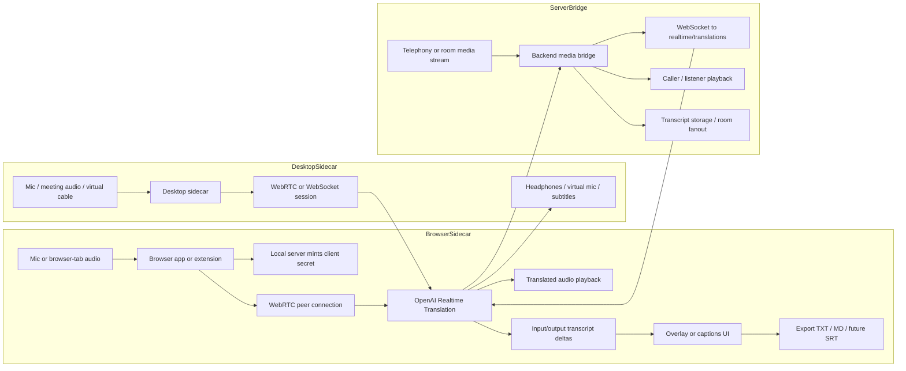
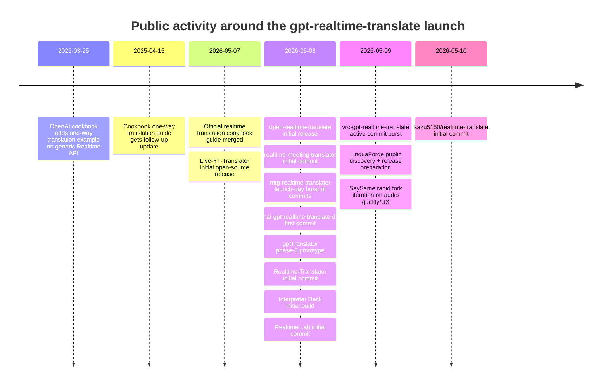

# Open-Source Survey of gpt-realtime-translate Projects

## Executive summary

The May 2026 launch is, in the public materials I reviewed, first and foremost an API release from urlOpenAIhttps://openai.com. The official docs define a dedicated `/v1/realtime/translations` endpoint for `gpt-realtime-translate`, recommend entity["software","WebRTC","web real-time communication API"] for browser and mobile clients, recommend WebSockets for backend media pipelines, price the model at $0.034 per minute of audio, and describe translation output as 200 ms audio chunks with transcript deltas. The same docs also make clear that this is not a standard Realtime voice-agent session: there is no turn lifecycle, no `response.create`, no tool calling, no custom prompting, and no voice-selection control surface in the translation product. citeturn23view1turn23view2turn23view4

In this best-effort public survey, cut at **May 10, 2026**, I found **14 direct launch-period public implementations/examples** that explicitly reference `gpt-realtime-translate` or the Realtime Translation API in repo titles or READMEs, plus a smaller layer of pre-May-2026 “adjacent” projects built on the older generic Realtime API translation pattern. A useful meta-signal is that an exact urlGitHubhttps://github.com repo search for `gpt-realtime-translate` undercounts the ecosystem, while a broader repository search for `"OpenAI Realtime" translation` surfaces a wider set of demos, wrappers, and local experiments. citeturn2view0turn31view0turn32view0

The ecosystem is young but already diverse. The dominant patterns are: browser-side sidecars that capture mic or tab audio and connect over WebRTC; local desktop sidecars that use virtual audio devices around meeting apps like entity["software","Zoom","video conferencing software"], entity["software","Google Meet","video conferencing software"], and entity["software","Microsoft Teams","collaboration software"]; and server-side media bridges for telephony or room backends. What is mostly _missing_ so far is standalone reusable SDK packaging and rigorous benchmarking. Benchmarks are thin: the official docs specify 200 ms output chunking, `open-realtime-translate` claims roughly 1.5 seconds to audible replacement, and most other repos discuss VAD, pre-warming, audio quality, or session UX rather than publishing repeatable latency test results. citeturn23view4turn27view0turn17view6turn36view2

## What the release changed

The most important technical change is that live translation is no longer presented as “prompt a general Realtime voice model to translate.” The official docs define a dedicated translation session model, target-language-first configuration, a dedicated endpoint, and a continuous audio-in / continuous translation-out flow. The guide explicitly says translation sessions are configured around `session.audio.output.language`, that the model currently supports 70+ input languages and 13 output languages, and that if you want source-language transcripts you pair it with `gpt-realtime-whisper`. It also states that browser-based apps should use entity["software","WebRTC","web real-time communication API"], while backend pipelines should use WebSockets. citeturn23view4turn23view1

That public positioning answers the practical “API vs. web/mobile” question in a precise way: the documented capability is **API-first**, but it is explicitly meant to power **browser and mobile apps** that developers build using the API, especially through WebRTC. In the official material I reviewed, I did **not** find a separate first-party consumer-product spec for a built-in ChatGPT web or mobile toggle; what I found is developer documentation and cookbook examples for browser, telephony, and meeting-room architectures. citeturn23view1turn23view4

## Public catalog of implementations

GitHub’s broader repository search returns a mixed bag: direct launch-week adopters, older generic Realtime translation projects, and a few unclear migrations. The table below separates the **direct** implementations I could verify from README/title/commit evidence from **adjacent or pre-model** projects that are still useful for architecture patterns. citeturn31view0turn32view0

### Direct launch-period implementations

| Project                                                                 | Form factor                                                                      |                     Primary language | License                        | Last activity | Integration method                                                                                 | Capabilities                                                                                                                                                  | Run / deploy notes                                                                                   | Evidence                                                |
| ----------------------------------------------------------------------- | -------------------------------------------------------------------------------- | -----------------------------------: | ------------------------------ | ------------- | -------------------------------------------------------------------------------------------------- | ------------------------------------------------------------------------------------------------------------------------------------------------------------- | ---------------------------------------------------------------------------------------------------- | ------------------------------------------------------- |
| urlopenai/openai-cookbook realtime_translation_guide.mdxturn23view4 | Official guide + reference demos                                                 | MDX + JavaScript/TypeScript examples | Unspecified in captured source | 2026-05-07    | WebRTC browser demo, WebSocket Twilio example, room fanout pattern                                 | Audio in/out, streaming, input + output transcript deltas, browser/tab + phone + room patterns                                                                | Browser demo runs locally with `npm`; LiveKit demo with `pnpm`; official reference layer             | citeturn23view4turn12view5turn25search0            |
| urlsugarforever/open-realtime-translateturn5view1                   | Chrome extension                                                                 |                           TypeScript | MIT                            | 2026-05-08    | Explicit WebRTC via `/v1/realtime/translations/calls`                                              | Tab audio in, translated audio out, bilingual subtitles, ~1.5 s claim, streaming                                                                              | `npm install`, `npm run build`, then load unpacked in entity["software","Chrome","web browser"]   | citeturn28view0turn9view0                           |
| urlpetergpt/Live-YT-Translatorturn5view2                            | Chrome extension                                                                 |                           JavaScript | MIT                            | 2026-05-07    | Browser client-secret flow; transport not spelled out in excerpt                                   | Live browser-video translation, translated speech, caption overlay                                                                                            | Clone/download, then load unpacked; optional local bridge mode for safer key handling                | citeturn25search1turn9view1                         |
| urlgyokuro33/realtime-meeting-translatorturn5view3                  | entity["software","Electron","desktop application framework"] desktop sidecar |                           TypeScript | Unspecified                    | 2026-05-08    | Realtime Translation API; transport unspecified in README excerpt                                  | Bidirectional meeting translation with virtual audio cables, translated audio + subtitles, cost display                                                       | `npm install`, `npm run dev`; designed around VB-CABLE A+B on Windows                                | citeturn27view1turn9view2turn14view2               |
| urlnanameru/mtg-realtime-translatorturn5view4                       | Desktop/local Python app                                                         |                               Python | MIT                            | 2026-05-08    | Explicit WebSocket to `wss://api.openai.com/v1/realtime/translations?model=gpt-realtime-translate` | Mic or virtual-device audio, streaming translation, VAD, WS pre-warm, desktop audio routing                                                                   | `python -m venv`, install requirements, then `python app.py`                                         | citeturn14view3turn17view6turn9view3               |
| urlryosukehata/openai-gpt-realtime-translate-demoturn5view5         | Local Next.js demo                                                               |                           TypeScript | Unspecified                    | 2026-05-08    | Explicit WebRTC with `/api/session` and SDP offer/answer                                           | Microphone or tab audio, translated speech, source transcript, translated captions                                                                            | Local demo only; README says auth/rate limiting/logging are intentionally out of scope               | citeturn17view7turn14view4turn11view0              |
| urlcympfh/vrc-gpt-realtime-translateturn5view6                      | Windows GUI for entity["software","VRChat","social virtual reality platform"] |                                 Rust | MIT                            | 2026-05-09    | Realtime API transport unspecified in README excerpt                                               | Mic audio in; translated text streamed to the VRChat chatbox over OSC; no translated audio playback path described                                            | Download `exe` from releases page; Windows 11 + VRChat OSC required                                  | citeturn15view2turn12view0                          |
| urllotfb86/gptTranslatorturn5view7                                  | macOS menu-bar / entity["software","Tauri","desktop app framework"] roadmap   |                                 Rust | Unspecified                    | 2026-05-08    | Realtime API transport unspecified in README excerpt                                               | Mic-in speech translation; roadmap includes browser audio capture and virtual mic/speaker flow using entity["software","BlackHole","virtual audio driver"] | Current “phase 0” is `npm run translate`; requires `brew install sox`                                | citeturn27view2turn12view1                          |
| urlstaniszewskimarek/Realtime-Translatorturn5view8                  | Lightweight web app / Space-style wrapper                                        |                    HTML + JavaScript | Other                          | 2026-05-08    | Explicit WebRTC; Node.js + Express + WebRTC                                                        | Live speech-to-speech translation, translated audio, transcript                                                                                               | Browser demo with API key in browser or secret in hosting environment                                | citeturn15view4turn17view10turn12view2turn14view7 |
| urlkazu5150/realtime-translateturn33view0                           | Web app for MacBook/iPhone use                                                   | JavaScript inferred from repo layout | Unspecified                    | 2026-05-10    | Explicit WebRTC                                                                                    | Browser mic capture, Japanese subtitles, optional speaker/earphone playback                                                                                   | `npm start`; use `ngrok` for iPhone HTTPS access                                                     | citeturn39view0turn35view0                          |
| urlellrnqq/interpreter-deckturn33view1                              | Browser “translation booth” demo                                                 |                           JavaScript | Unspecified                    | 2026-05-08    | Explicit client-secret + WebRTC                                                                    | Mic or tab audio, translated speech, source + translation subtitles, pinned moments                                                                           | Local server issues client secret at `/session` and serves static UI                                 | citeturn34view0turn39view1turn36view0              |
| urlrocosrex/LinguaForgeturn33view2                                  | Localhost PoC for browser-video translation                                      |                    HTML + JavaScript | MIT                            | 2026-05-09    | Explicit WebRTC                                                                                    | Chrome tab audio capture, translated audio, captions, Markdown transcript export                                                                              | Localhost-only by default; local Express server keeps API key server-side; has a v0.1.0 release      | citeturn38view2turn36view1                          |
| urlfanispoulinakisai-boop/saysameturn33view3                        | Chrome extension                                                                 |                           JavaScript | MIT                            | 2026-05-09    | Browser extension; fork lineage from Live-YT; local bridge optional                                | Voice mode and cheaper text-only mode, multi-site support, live cost ticker, transcript download                                                              | Extension install + optional local relay/bridge; significant UI and multi-site expansion over parent | citeturn38view3turn36view2                          |
| urlJoseAI-Automatizaciones/realtime-labturn33view4                  | HTML-first lab                                                                   |                           JavaScript | Unspecified                    | 2026-05-08    | WebRTC for voice/translation; WebSocket for transcription                                          | Live voice chat, live translation, realtime transcription, multimodal image+text session tests                                                                | `npm start`, then open localhost; ephemeral-token model from local server                            | citeturn39view2turn36view3turn37view4              |

### Adjacent or pre-model predecessor projects

| Project                                                                             | Why it matters                                                                        |    Primary language | License                         | Last activity      | Integration method                                                    | Status relative to May 2026 translation endpoint                                               | Evidence                                               |
| ----------------------------------------------------------------------------------- | ------------------------------------------------------------------------------------- | ------------------: | ------------------------------- | ------------------ | --------------------------------------------------------------------- | ---------------------------------------------------------------------------------------------- | ------------------------------------------------------ |
| urltwilio-samples/live-translation-openai-realtime-apiturn5view0                | Most mature open telephony bridge; still the clearest public call-center architecture |          TypeScript | MIT                             | Updated 2024-09-30 | Twilio Media Streams + server WebSockets                              | **Predates** `gpt-realtime-translate`; useful predecessor, not direct endpoint evidence        | citeturn20view0turn19view1turn21view0             |
| urlopenai/openai-cookbook one_way_translation_using_realtime_api.mdxturn23view3 | Official pre-May-2026 one-way translation workflow                                    |   MDX + JS examples | Unspecified in captured source  | 2025-04-15         | Realtime + WebSockets + Socket.IO relay                               | Predecessor pattern using older generic Realtime API, not the dedicated translation endpoint   | citeturn23view3turn12view6                         |
| urllivekit-examples/live-translated-captioningturn5view10                       | Strong room/caption pattern                                                           |   TypeScript/Python | Unspecified in captured source  | 2025-01-27         | LiveKit transport + STT + text translation                            | Uses GPT-4o for text translation; not a `gpt-realtime-translate` audio-to-audio implementation | citeturn18view0turn12view4turn14view9             |
| urlAzure-Samples/realtime-translationturn5view9                                 | Heavy cloud-native reference architecture                                             | Python + TypeScript | MIT                             | 2025-12-19         | WebSocket-driven orchestration around Azure GPT-4o Realtime           | Adjacent but not direct; cloud architecture useful, translation model differs                  | citeturn18view1turn12view3turn22view0turn22view1 |
| urlasimsan/realtime-translation-appturn33view5                                  | Mobile-ish speech translation app with AirPods and extra TTS layer                    |          TypeScript | MIT                             | 2025-10-10         | WebSocket connection to OpenAI Realtime API plus separate TTS service | Adjacent; README points to generic Realtime API and fallback TTS, not the dedicated endpoint   | citeturn34view4turn37view5turn38view5turn36view4 |
| urlashavolian/translate-iosturn33view6                                          | Early iOS clinical-interpreter prototype                                              |               Swift | TBD / internal prototyping only | 2025-09-07         | Public OpenAI Realtime API with ephemeral tokens; on-device TTS       | Adjacent; clearly pre-launch relative to `gpt-realtime-translate`                              | citeturn34view5turn37view6turn38view6turn36view5 |

A wider GitHub search also surfaced additional **indexed but not fully confirmed** repositories such as urlhu-ke/openai-realtime-translationhttps://github.com/hu-ke/openai-realtime-translation, urlPolymonomers/openai-realtime-translationhttps://github.com/Polymonomers/openai-realtime-translation, urlvoxworld/voxaudiohttps://github.com/voxworld/voxaudio, urlnitin4real/s2s-agora-openai-realtime-translationhttps://github.com/nitin4real/s2s-agora-openai-realtime-translation, urllsampras/realtime-translated-chat-rshttps://github.com/lsampras/realtime-translated-chat-rs, urlalijouini1218/live-translator-apphttps://github.com/alijouini1218/live-translator-app, urlmizunotaro/realtime-transcribe-translator-recaphttps://github.com/mizunotaro/realtime-transcribe-translator-recap, and urlasayoyaasa/asterisk-translation-serverhttps://github.com/asayoyaasa/asterisk-translation-server. I am classifying these as **unspecified** in this report because the indexed metadata I reviewed did not give me enough direct evidence to confirm migration to `gpt-realtime-translate` or `/v1/realtime/translations` specifically. citeturn31view0turn32view0

## Detailed analysis of the most relevant projects

### The official cookbook is still the reference implementation

The single most important source is the official cookbook guide, because it captures the conceptual model that almost every serious launch-week project follows: target-language-based sessions, browser-side WebRTC, backend-side WebSockets, and no turn-by-turn assistant orchestration. The guide uses three concrete reference architectures: browser tab translation, phone-call translation with a server media bridge, and meeting-room fanout for group environments. It landed in the cookbook on May 7, 2026 through PR #2667. citeturn23view4turn12view5turn22view2

One of the strongest signals of its influence is that community projects are already citing it directly. `open-realtime-translate`, for example, says its WebRTC integration is closely modeled on the official Realtime Translation guide and cookbook. That makes the official documentation not just explanatory material, but the de facto upstream implementation pattern for the early ecosystem. citeturn28view0

### The cleanest browser-side build is open-realtime-translate

urlsugarforever/open-realtime-translateturn5view1 is the clearest expression of the new API’s “browser sidecar” value proposition. It is a Manifest V3 Chrome extension that isolates the API key in a service worker, mints short-lived client secrets, runs the peer connection inside an offscreen document, and renders subtitle deltas in a shadow-DOM overlay. The README is unusually explicit about architecture, security boundaries, stack choices, and limitations. It is also one of the few repos that offers a user-perceivable latency claim: roughly 1.5 seconds until translated audio replaces the original tab audio. citeturn28view0turn27view0turn14view0

For practical builders, the strengths are threefold. First, it uses the exact dedicated Translation call path rather than the older “translate with a voice model” trick. Second, it has a reasonably production-minded browser security posture for a hack-week project: the browser renderer never receives the full API key. Third, it already documents real-world limitations that many newer repos merely discover later: no native-app audio capture, no side-by-side original+translated mix, no glossaries, and silence when speech is already in the target language. citeturn28view0

### Live-YT-Translator is the seed project; SaySame is the most substantive fork

urlpetergpt/Live-YT-Translatorturn5view2 is the most visible single-site browser extension in the launch window. It targets browser-video translation on a specific source, uses a short-lived client-secret flow, and offers an optional local bridge so users do not have to store their API key inside extension storage. For many developers, it is the simplest “clone this and make it yours” starting point. citeturn25search1turn17view2

The most meaningful fork I found is urlfanispoulinakisai-boop/saysameturn33view3. This repo is explicit about its lineage from `Live-YT-Translator`, expands coverage from one site to many, adds a cheaper text-only mode, ships a live cost ticker, auto-downloads transcript text, and shows much more rapid iteration than the parent repo, with 60 commits by May 9. In a launch-week survey, **SaySame** is the clearest example of ecosystem branching rather than mere bookmarking. citeturn38view3turn36view2turn25search1

### Nanameru’s Python app is the most interesting low-latency WebSocket local stack

urlnanameru/mtg-realtime-translatorturn5view4 stands out because it does not hide the core media mechanics. The README explicitly says it opens a WebSocket to `wss://api.openai.com/v1/realtime/translations?model=gpt-realtime-translate`, streams 24 kHz / 20 ms chunks, uses local Silero VAD to detect utterance boundaries, sends a short silence tail to help server VAD commit the segment, and pre-warms the WebSocket at launch so handshake time is not paid at the moment the user hits Start. citeturn17view6turn14view3

That is more sophisticated latency engineering than most of the other launch-week repos. The app is also operationally concrete, with input and output device selection, virtual-device guidance for meetings, and a sequence of follow-up commits on the same day for end-of-utterance behavior, documentation, and licensing. If the question is “which public repo best exposes the server-side / raw-audio mechanics of the new endpoint,” this is arguably the strongest answer. citeturn10view0turn14view3turn17view6

### The desktop meeting-sidecar pattern is already real

urlgyokuro33/realtime-meeting-translatorturn5view3 is important because it demonstrates that the Realtime Translation API can sit **beside** mainstream meeting software rather than inside meeting-platform SDKs. Its stated design is a sidecar desktop app built with entity["software","Electron","desktop application framework"] plus VB-CABLE virtual devices, explicitly without depending on the APIs or plug-ins of entity["software","Microsoft Teams","collaboration software"], entity["software","Zoom","video conferencing software"], or entity["software","Google Meet","video conferencing software"]. The architecture diagram in the README shows one translation direction for the user’s mic and another for the remote party’s audio, with the meeting app simply seeing unusual microphone and speaker devices. citeturn27view1turn17view4turn17view5

That is a strategically important pattern because it lowers integration friction. Instead of waiting for official platform hooks, builders can ship translation by controlling local audio routing. The trade-off is that, in the README evidence I reviewed, the exact transport detail is less explicit than in the browser- or Python-first repos, so I mark the connection layer as unspecified rather than over-asserting WebRTC or WebSocket. citeturn27view1turn9view2

### LinguaForge is the best-documented localhost PoC

urlrocosrex/LinguaForgeturn33view2 is a particularly solid local proof of concept. The repo openly describes itself as a localhost PoC, bound to loopback by default, with the API key staying on the local server. It captures Chrome tab audio with `getDisplayMedia()`, creates short-lived Realtime Translation client secrets on a local Express server, streams the captured audio to `gpt-realtime-translate` over WebRTC, plays translated audio back in the browser, renders captions, and exports a Markdown transcript. It also has a release tag (`v0.1.0`) and a `Known Limitations` section that is more mature than most launch-week siblings. citeturn38view2turn36view1

The repo is also unusually candid about product boundaries: dynamic voice adaptation is a limitation rather than merely a cool feature, glossary/voice-selection/prompting control is absent, browser tests are only source-contract tests, and transcript export currently captures translated text only. That kind of boundary-setting is exactly what many early demos are missing. citeturn38view2

### The thin-demo layer is valuable, but mostly scaffold-quality

There is a whole band of launch-week scaffolds whose value is not polish but speed of comprehension: urlryosukehata/openai-gpt-realtime-translate-demoturn5view5, urlellrnqq/interpreter-deckturn33view1, urlkazu5150/realtime-translateturn33view0, and urlJoseAI-Automatizaciones/realtime-labturn33view4. These projects tend to converge on the same basic shape: a tiny local server, short-lived client-secret minting, browser-side WebRTC, a simple UI for mic or tab capture, and minimal persistence or ops. citeturn17view7turn39view1turn39view0turn39view2

The upside is that they are easy to understand and repurpose. The downside is that most are frank about being demos or omit operational hardening entirely. `ryosukehata` explicitly says authentication, rate limiting, logging, deployment, and multi-user rooms are out of scope. `Interpreter Deck` warns about runaway usage cost and recommends session limits and hold-to-translate patterns. `kazu5150` focuses on practical local use, even including an `ngrok` path for iPhone HTTPS. `Realtime Lab` broadens the surface area by combining translation, live voice chat, and transcription in a single HTML-first test bench. citeturn13view11turn39view1turn39view0turn39view2

### Mobile and specialized clients are already appearing

Two interesting edge cases show how quickly the API was wrapped into specialized form factors. urlcympfh/vrc-gpt-realtime-translateturn5view6 targets entity["software","VRChat","social virtual reality platform"], taking microphone audio, translating it in realtime, and sending translated text incrementally into the VRChat chatbox over OSC. It is not a translated-audio app; it is a translation-output-to-chatbox app. That makes it a useful reminder that not every Realtime Translation client needs audio output. citeturn15view2

On the mobile side, urlashavolian/translate-iosturn33view6 is older and therefore adjacent rather than direct, but it is still worth noting because it frames a clinician–patient interpreter workflow with ephemeral token minting and on-device TTS. Separately, a Reddit post in `r/vibecoding` described a polished closed-source mobile wrapper built in less than a day on top of the Realtime Translation API, but the thread I reviewed did not link a public open-source repository. That is a useful ecosystem signal: packaging is moving faster than open-source consolidation. citeturn34view5turn42view2

## Architecture patterns in the wild

The official docs and the public repos converge on three architecture families. The first is the **browser-side sidecar**, where a local or lightweight backend mints a short-lived client secret and the browser handles capture, playback, and subtitle rendering over entity["software","WebRTC","web real-time communication API"]. The second is the **desktop audio sidecar**, where a local app wraps system or meeting-app audio through virtual devices. The third is the **server media bridge**, where telephony or room infrastructure sends raw audio to a backend over WebSockets and that backend bridges to OpenAI’s Realtime Translation endpoint. citeturn23view1turn23view4turn28view0turn17view6turn19view1

Storage and transcript handling are still inconsistent, but there is already a recognizable pattern. `LinguaForge` exports Markdown transcripts, `SaySame` auto-downloads a text session file, `Interpreter Deck` saves pinned moments, and `open-realtime-translate` lists transcript export as an obvious extension point rather than a shipped feature. That suggests the next wave of OSS will probably move from “make it translate” to “make it operationally useful after the session ends.” citeturn38view2turn38view3turn34view0turn28view0

## Activity timeline and ecosystem signals

Public project activity is tightly clustered around the release window. The official cookbook guide landed on May 7, 2026. Then a burst of GitHub repos appears on May 8 and May 9 across browser extensions, meeting sidecars, desktop utilities, and local demos, with another simple web app landing on May 10. That density is a strong indicator that the model’s launch immediately triggered community implementation work rather than a long incubation period. citeturn12view5turn9view0turn9view1turn9view2turn9view3turn11view0turn12view0turn12view1turn12view2turn35view0turn36view0turn36view1turn36view2turn36view3

One of the more interesting ecosystem signals is how much of the very first wave came from **UI-wrapped app projects**, not libraries. We got Chrome extensions, Windows/Rust tooling, Electron sidecars, a Tauri road-map project, and web demos almost immediately. What we did **not** get, in the material I was able to verify, is a single clearly dominant unofficial JavaScript, Python, or Swift package whose primary value is “support the Realtime Translation endpoint.” The wrappers are mostly still embedded inside end-user apps. citeturn28view0turn25search1turn27view1turn15view2turn27view2turn39view2

## Community threads, forks, mirrors, and overall assessment

The community discussion I found is still thin and practical rather than expansive. An older urlHacker News discussion of the Twilio sampleturn42view1 focused on whether Twilio Media Streams and PSTN would prove higher-latency than SIP/WebRTC backends. A related urlStack Overflow question about literal translation drift in a Twilio + OpenAI Realtime setupturn42view0 complained about delay, the model slipping into conversational behavior, and inconsistent transcription events. Those two threads are especially useful because they explain _why_ `gpt-realtime-translate` exists as a specialized model rather than just a prompt recipe on top of a general Realtime voice model. citeturn42view0turn42view1turn23view4

Release-week Reddit traffic was mostly announcement chatter, but it does show attention. I found launch-news threads discussing the new model family and one `r/vibecoding` thread describing a closed-source mobile wrapper built on top of the Realtime Translation API within 24 hours. That does not count as open-source evidence, but it is a sign that packaged mobile experiences are already being built faster than public repos are being cleaned up and documented. citeturn41search0turn41search7turn42view2

On forks, the clear substantive derivative I could verify is **SaySame**, which explicitly identifies itself as a fork of `Live-YT-Translator` and materially expands it. Beyond that, several direct repos already show nontrivial fork counts even in the first days: Twilio’s predecessor sample has 43 forks, `Live-YT-Translator` has 6, `mtg-realtime-translator` has 8, and `open-realtime-translate` has 4. That suggests code copying and adaptation are happening faster than issue/PR discussion. In fact, most direct launch-week repos I audited still show **0 open issues and 0 PRs**, so commit histories are currently more informative than trackers for ecosystem assessment. citeturn38view3turn25search1turn9view3turn28view0turn21view0turn36view1turn36view2turn35view0

I did **not** find a confirmed dedicated GitLab or Bitbucket mirror for the new Translation endpoint in the public indexed search results I checked, and I did **not** find a clearly dominant standalone unofficial SDK package dedicated to `/v1/realtime/translations`. I would treat both of those as survey limitations rather than proof of absence. What I can say with confidence is that, as of May 10, 2026, the open ecosystem is in a **launch-week proto-production phase**: there is enough code to copy, enough variety to choose patterns, and enough evidence to build real browser or desktop tools today, but not yet a mature layer of shared libraries, benchmark suites, or battle-tested ops modules sitting underneath those apps. citeturn31view0turn32view0turn23view4turn28view0turn17view6turn19view1
