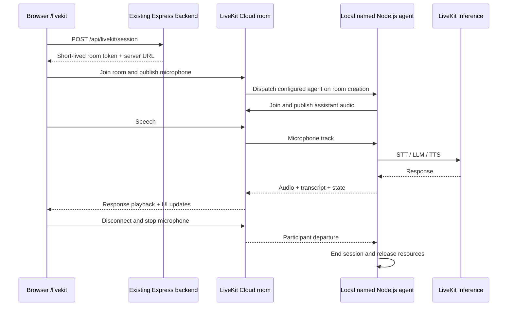

# LiveKit Cloud Demo Implementation Plan

Status: blocked on external acceptance. Implementation and automated/live synthetic-audio checks are delivered; human device testing and authenticated dashboard checks remain unverified.

## Implementation handoff — awaiting external acceptance

- Branch: `feat/livekit-cloud-demo`. Baseline checks: 825 tests passed, lint and formatting passed before implementation.
- Installed pinned browser/server SDKs: `livekit-client` 2.22.3, `@livekit/components-react` 2.9.24, `livekit-server-sdk` 2.18.0. Isolated Node agent uses `@livekit/agents` 1.8.0 and builds successfully.
- Implemented configuration/token routes, shared bounded configuration, microphone-only grants, explicit dispatch, provider registration, `/livekit`, transcript, controls, help, and cyan waveform UI. Local ignored `.env` now enables LiveKit.
- The local agent registered with the cloud project. A real browser session verified speech recognition, model response, assistant audio playback, interruption, mute, and end with retained transcripts using synthetic microphone input. The latest worker also passed a synthetic-audio conversation through ngrok; ordinary job logs showed no transcript markers.
- SDK decision: use manual `Room` lifecycle plus React room/transcription/audio hooks. Inspection of installed `useSession` showed token fetch on mount and unawaited token refresh on `end()`. Explicit token issuance only on Start and deterministic cancellation are better served by the documented Room API here. This supersedes the Session API preference below.
- Visual reference generated and inspected: `/home/aiwithapex/.codex/generated_images/01a0812c-e6ed-7090-b507-4896f6c61a3f/exec-3b4e99be-1500-4564-9929-2dc757ed4e70.png`. Tokens: zinc `#09090b`, transcript `#0c0c0f`, cyan `#67e8f9`, muted `#a1a1aa`, sans display type, open left stage and one bordered right panel. Spoken suggestions are plain text, despite decorative arrows in the concept, to avoid implying unsupported chat actions.
- Browser plugin unavailable; using repository Playwright. Earlier checkpoint: 855 root tests, 4 agent tests, agent type/build checks, root typecheck/lint/format checks, and 50 Chromium CI regression tests passed. The 4 LiveKit E2E cases passed on every configured project, including Firefox. Production demo build succeeded.
- Resolved ngrok startup: ignore example `.env` placeholders, respect explicit process environment, merge the saved CLI configuration, and start only the project `demo` tunnel. Startup failures expose diagnostic codes rather than credential-bearing output; generated configuration is owner-readable only. Five regression tests cover saved configuration, environment precedence, credential-safe failures, quoted passwords, and incomplete basic authentication.
- Two actual `npm run demo` windows worked through the public HTTPS endpoint. The ngrok account reuses its assigned domain, which is valid; configuration was regenerated and no duplicate workers remained. First window verified STT/LLM/TTS, audio playback, transcript, end, and 360px layout. Second verified separate simultaneous visitor rooms and 30-second session caps. With the browser configured to allow 600 seconds, the actual agent still ended the call after 33.9 seconds from Start and delivered the duration-limit notice.
- Both windows were stopped; ports 3001/4041/8081 were free, owned worker children stopped, and the cloud room showed zero participants/publishers. Public endpoint shutdown was checked separately. Shutdown currently uses the documented five-second force-kill fallback for the worker. No permanent agent was deployed.
- Screenshots: `/tmp/livekit-ngrok-desktop.png` and `/tmp/livekit-ngrok-mobile.png`; the 360px mobile screenshot was inspected with no horizontal overflow. Logs: `/tmp/pupu-livekit-tests-final.log`, `/tmp/pupu-livekit-regression.log`, `/tmp/pupu-firefox-final.log`, `/tmp/pupu-ngrok-tests.log`. These local artifacts are not tracked.
- Follow-up audit: all 45 LiveKit browser cases passed across Chromium, Firefox, WebKit, Mobile Chrome, and Mobile Safari. They cover route/provider cleanup, re-entry, 360/390/768/1440px layouts, reduced motion, and 44px Start targets. Lifecycle tests additionally verify brief reconnect recovery without a new token, stalled reconnect cleanup, pipeline-end notice, audio unlock, and transcript revision/finalization. Root suite now passes 863 tests; latest type/lint/format and agent checks pass. The final production demo build succeeded.
- Password-protected ngrok verification: unauthenticated `/livekit` and `/api/livekit/session` returned 401; browser credentials allowed the page, token issuance, and actual agent greeting without page errors. Repeated final configuration/token requests returned 200, exposed the 30-second agent wait setting, and matched the exact allowed Origin. Wrong origins received no ACAO header. Actual token bursts hit 429 with Retry-After and request ID. Temporary protected windows were stopped afterward.
- Corrected ngrok handling for quoted passwords: dotenv parsing preserves `#` and escapes, JSON-quoted YAML preserves backslashes/quotes, and incomplete basic-auth settings fail startup. Added regression tests. `LIVEKIT_AGENT_WAIT_SECONDS` now implements the planned configurable 30-second default, bounded to integer 5–120 seconds. Session caps below one minute display as `0:30` rather than `0 min`.
- Remaining external acceptance: human microphone/speaker quality, interruption and mobile audio from a separate device; authenticated LiveKit dashboard/official Agent Console and project-level observability retention. `agent-browser --auto-connect` confirmed there is no attachable Chrome instance; CLI auth works but does not expose those dashboard settings. Two concise asynchronous requests were sent for device testing and dashboard access/settings. No tunnel is left open while waiting. Do not claim those checks complete from synthetic audio or from `record: false` alone.

Resumption: the same external acceptance dependency remained across three goal turns. The latest check again found no attachable Chrome and no demo listeners on ports 3001/4041/8081. Resume when the user can test from a separate device and provide authenticated dashboard access or retention settings. Start a temporary demo window only for that agreed test, record the outcome here, and close it afterward. Do not repeat the already-passing test suites unless new changes or failures warrant it.

Reviewed: 2026-09-08. Repository baseline: `cfc0a8a` on `main`.

## Outcome and scope

Add a polished LiveKit Cloud voice demo that feels native to PuPuPlatter, is discoverable alongside the existing voice providers, and has a shareable `/livekit` URL. A visitor can start a conversation, hear and interrupt the assistant, read live transcripts, mute their microphone, end the call, and start again. The implementation includes the agent, backend, frontend, temporary demo orchestration, documentation, and verification needed to make that experience work end to end.

Confirmed operating model: run the app and agent locally and open a temporary ngrok tunnel for scheduled client demos. Permanent public hosting and a deployed cloud agent are optional future work, not prerequisites or acceptance requirements. Scheduling means an operator starts and stops the demo for the agreed client window; automated scheduling is not requested.

Recommended initial experience: an English, general-purpose PuPuPlatter assistant with brief spoken answers and a warm greeting. Use one server-configured STT/LLM/TTS pipeline through LiveKit Inference. Model selection, voice customization, telephony, camera/video, screen sharing, recording, translation, external tools, and persistent conversation history are follow-up features. Do not add controls for capabilities that have not been implemented.

These are implementation defaults, not outstanding product questions. No additional product decision is needed to begin.

## Planning baseline evidence and readiness

| Item               | Evidence                                                                                                                                  | Implication                                                                                     |
| ------------------ | ----------------------------------------------------------------------------------------------------------------------------------------- | ----------------------------------------------------------------------------------------------- |
| Application        | React 19, Vite 8, TypeScript, Tailwind, Framer Motion; Express backend in `server/index.js`                                               | Extend the existing app; no separate Next.js frontend                                           |
| Navigation         | `src/App.tsx` currently routes `/` and a catch-all; provider views live in `src/pages/Index.tsx`                                          | Add a real route and reuse its demo surface in the existing switcher                            |
| Provider plumbing  | `src/types/voice-provider.ts`, `ProviderContext`, `ProviderTabs`, provider contexts/hooks                                                 | Register `livekit` with the same availability and cleanup conventions                           |
| Backend patterns   | `server/routes/retell.js`, `server/utils/security.js`, provider status in `server/index.js`                                               | Reuse validation, safe errors, request IDs, token rate limits, and configuration reporting      |
| API routing        | `src/lib/apiConfig.ts` and `public/config.template.js` support local, ngrok, and production API origins                                   | Use the existing API URL helper, not a hard-coded localhost URL                                 |
| LiveKit CLI        | Installed `lk` 2.18.6; authenticated project is `test-project`                                                                            | Local CLI setup is available                                                                    |
| Credentials        | Earlier in this thread, isolated `lk room list` using `.env` credentials succeeded; `.env` is ignored and `.env.example` has placeholders | Credentials worked for room access; this does not prove model inference or deployment readiness |
| Cloud deployment   | Planning-time `lk agent list` succeeded and returned `No agents found` for `test-project`                                                 | No cloud deployment is required: run the named agent locally against LiveKit Cloud              |
| SDK integration    | No direct LiveKit packages, provider implementation, backend route, or agent project in the current repository                            | These are implementation work, not just missing environment variables                           |
| Browser policy     | Existing CSP already permits LiveKit Cloud/LiveKit HTTPS and WSS domains                                                                  | Validate actual connection behavior; do not widen CSP by default                                |
| Demo orchestration | `scripts/demo.sh` builds the frontend, serves it and the API through Express on port 3001, and opens one ngrok tunnel                     | Extend this existing workflow to start and stop the local LiveKit agent                         |

## Architecture decisions

LiveKit supplies realtime transport and an agent framework. A room connection alone will not answer the visitor: a running agent must join the room and execute the speech pipeline. The official [voice agent quickstart](https://docs.livekit.io/agents/start/voice-ai/) supports Node.js and demonstrates a LiveKit Inference pipeline. Use Node.js to match this repository, in an independently packaged `agents/livekit/` directory.

The local agent maintains its connection to LiveKit Cloud. The client's browser fetches the page and session token through ngrok, then exchanges realtime media directly with LiveKit Cloud; the local agent also exchanges media with LiveKit Cloud. No inbound agent tunnel or second media proxy is needed. Keep the local machine awake and connected during the demo window. Express uses production serving mode for the built frontend, but that does not mean the app is permanently hosted.

LiveKit Inference provides supported STT, LLM, and TTS models through the cloud project, without separate provider plugins for that path. Usage is billed and subject to project limits. This makes it the recommended initial integration; extra OpenAI, Deepgram, or TTS-provider keys are not inherently required. Confirm project access with an actual agent session before calling it ready. See [LiveKit Inference](https://docs.livekit.io/agents/models/inference/).

At implementation time, choose and pin a compatible released set of `livekit-client`, `@livekit/components-react`, `livekit-server-sdk`, and `@livekit/agents`. Verify React 19 compatibility, Node runtime requirements, and SDK exports before building against examples. Keep the agent's dependencies, lockfile, TypeScript configuration, model assets, and container separate from the web server. Node v24.15.0 is available locally; select and test a supported production runtime for the agent.

Prefer the current React Session APIs (`useSession`, `SessionProvider`, `useAgent`, `useSessionMessages`) with a custom token source backed by Express. These APIs coordinate connection and agent lifecycle and expose media and transcript state. Keep the SDK behind a small application adapter so components use stable application state. Do not combine independent Session and Room controllers for the same connection. See [session management](https://docs.livekit.io/frontends/build/sessions/).

Use explicit dispatch to the server-selected name `pupuplatter-livekit-demo`, embedded in the room configuration of the join token. A unique room per conversation keeps sessions isolated and avoids creating a dispatch before the visitor connects. Do not also dispatch via a separate API call. The same dispatch name must be registered by the agent; it is distinct from the cloud agent ID and participant display name. See [agent dispatch](https://docs.livekit.io/agents/server/agent-dispatch/).

## Dedicated page and visual direction

Build `LiveKitDemo` as the shared content surface: the LiveKit tab renders it within the existing home shell; `/livekit` wraps the same component in a dedicated page shell. Add a share/open-page link in the tab. Avoid redirect loops or two simultaneously mounted LiveKit providers. Direct routing must work without a prior localStorage provider selection. Navigation away must clean up the active provider before the next session can start.

Use the existing dark zinc canvas, display typography, restrained borders, and spacious layout, with a distinct cyan accent for LiveKit. The visual centerpiece should be a finely drawn, audio-reactive waveform in a spacious conversation stage. Use actual microphone/assistant track activity while connected; idle decoration must not imply a live connection. Keep LiveKit branding accurate and use a verified brand asset or a plain text wordmark.

| Surface            | Required design and behavior                                                                                                                   |
| ------------------ | ---------------------------------------------------------------------------------------------------------------------------------------------- |
| Header             | PuPuPlatter identity, LiveKit Cloud label, back-to-providers link, setup/help entry                                                            |
| Hero               | Clear title such as “A conversation, in real time.”; one short explanation; prominent “Start conversation” button                              |
| Conversation stage | Waveform, separate connection and assistant state labels, elapsed session time; compact after connection so transcript stays visible           |
| Transcript         | Speaker-labelled user/assistant turns; partial text updates in place; empty-state guidance; final transcript remains after ending until reset  |
| Controls           | Start/end, microphone mute, supported microphone selection before starting, recoverable audio-playback activation prompt                       |
| Supporting copy    | Small “Try asking…” spoken-prompt suggestions; do not make them look like functional chat buttons unless implemented                           |
| Session end        | Clear ended state with “Start again” and “Clear transcript”; no automatic microphone restart                                                   |
| Failure            | Specific messages for denied microphone, unavailable agent, network failure, disabled configuration, or exhausted quota; relevant retry action |

Desktop: approximately 1120px maximum content width, balanced stage/transcript columns. Mobile: one column, stage first, reachable controls, no fixed-height transcript that traps scrolling, and no horizontal overflow at 360px. Check 360/390px, 768px, and 1440px viewports. Preserve visible keyboard focus, 44px touch targets, adequate contrast, text labels for state, and reduced-motion behavior. Announce meaningful state changes and completed transcript turns without continuously reading every partial token.

## Backend contract and controls

Add `server/routes/livekit.js` mounted at `/api/livekit`.

1. `GET /api/livekit/config`: return only public readiness, display metadata, and configured session limit. Distinguish “configuration present” from “agent verified online”; a cheap environment check must not claim the latter. Return no API credentials or join tokens.
2. `POST /api/livekit/session`: accept an empty JSON object initially; reject unsupported input. Generate a cryptographically random room name and participant identity on the server. Return `{ serverUrl, participantToken, roomName, participantIdentity, expiresAt }` with `Cache-Control: no-store`. Adapt this response to the exact pinned SDK token-source contract.
3. Sign a short-lived token, proposed join TTL of 5 minutes, restricted to that room and participant. Permit joining, subscribing, and microphone publishing; enable data publishing only if the selected frontend protocol needs it. Do not grant room administration, room listing, recording, or arbitrary media publishing. Attach only the configured agent's dispatch entry. See [tokens and grants](https://docs.livekit.io/frontends/reference/tokens-grants/).
4. Add the session route to `TOKEN_ENDPOINT_PATHS`, so it receives the existing token limiter and in-flight guard. Validate non-placeholder server configuration before signing. Apply existing exact-origin policy and structured errors; CORS alone is not authentication or a global spending limit.
5. Keep browser tokens in memory and redact credentials, tokens, and conversation content from ordinary logs. Return safe configuration/validation/rate-limit/provider errors with request IDs. Token signing can succeed while the agent or inference is unavailable; present those failures separately in the client.
6. Proposed initial session cap: 10 minutes, enforced by the agent as well as displayed in the browser. JWT expiry governs joining and must not be used as an active-call duration control. Add a short wait-for-agent deadline (30 seconds, configurable) and deterministic client cleanup if no usable agent appears.

The server must select room, identity, agent, pipeline, and permitted configuration. A public caller must not be able to submit an arbitrary agent name, endpoint URL, prompt, grant set, or model choice.

## Agent and lifecycle

Create `agents/livekit/` with a Node.js agent entrypoint, separate package/lockfile, example environment, build and startup scripts, and README. Adapt the official Node starter rather than importing the framework into the Express process. Document how the local agent reads the existing root `.env` without copying credentials into tracked files. Cloud registration, a deployment Dockerfile, and `livekit.toml` are optional hosting follow-up work.

Configure `pupuplatter-livekit-demo` as the explicit dispatch name. Start a short-answer conversational assistant with transcription, speech output, turn detection, and interruption handling. Select currently supported Inference model/voice identifiers during the initial spike and record them in the agent README; do not rely on an old example's model name or silently substitute providers.

The agent greets once after the intended human participant is present. It must end on participant departure, unrecoverable pipeline failure, shutdown, or the configured duration limit. Test agent cleanup independently of browser cleanup, including an abrupt tab close. Isolate rooms and conversational memory per job. Do not turn on recording or add transcript persistence for this demo; document any cloud observability retention enabled in the selected project.

Client states: idle → requesting permission/token → connecting → waiting for agent → listening/thinking/speaking → ending → ended, with reconnecting and error branches. A connected room is insufficient to show “Ready to talk.”

Use one SDK session instance per active demo. Prevent repeated start clicks, abort stale token requests, and ignore late events after cancellation. Stop local tracks, playback, listeners, timers, and SDK resources on end, provider switch, route navigation, timeout, failed connection, and unmount. During bounded network reconnection keep the current session; do not create new rooms on every reconnect attempt. Keep mute state accurate and render a user-gesture audio unlock action when browser autoplay blocks output.

Normalize transcripts into the existing message shape with stable IDs and speaker roles. Update interim segments in place, finalize without duplicates, and reject events from a previous session. Prefer SDK session messages to hand-built transcript event accumulation when supported by the pinned release.

## Configuration and file map

| Variable                                | Scope                   | Plan                                                                         |
| --------------------------------------- | ----------------------- | ---------------------------------------------------------------------------- |
| `LIVEKIT_URL`                           | Express and local agent | Existing `.env` value; configured cloud project URL                          |
| `LIVEKIT_API_KEY`, `LIVEKIT_API_SECRET` | Express and local agent | Existing server secrets; never add `VITE_` equivalents                       |
| `LIVEKIT_AGENT_NAME`                    | Express and agent       | Add matching dispatch name, default `pupuplatter-livekit-demo`               |
| `VITE_LIVEKIT_ENABLED`                  | Public build-time flag  | Add provider visibility/availability flag; enable only when rollout is ready |
| `LIVEKIT_SESSION_MAX_SECONDS`           | Express and agent       | Proposed `600`; validate bounds and enforce in agent                         |
| STT/LLM/TTS model and voice settings    | Agent only              | Add documented server-side settings if needed; pin known-working defaults    |

For this local workflow, Express and the agent read server credentials from the local environment, and the frontend receives only public configuration and short-lived tokens. If cloud agent hosting is added later, LiveKit Cloud supplies its deployment's `LIVEKIT_URL`, `LIVEKIT_API_KEY`, and `LIVEKIT_API_SECRET`; do not bake them into an image or override cloud-managed values. See [secrets management](https://docs.livekit.io/deploy/agents/secrets/) and [agent builds](https://docs.livekit.io/deploy/agents/builds/).

Expected changes:

- `src/pages/LiveKit.tsx`, `src/components/livekit/LiveKitDemo.tsx`, stage/controls/status components, `src/components/providers/LiveKitProvider.tsx`, `src/hooks/useLiveKitVoice.ts`, and `src/types/livekit.ts`.
- `src/components/conversation/LiveKitConversationPanel.tsx`, reusing the shared transcript presentation where practical.
- `src/App.tsx`, `src/pages/Index.tsx`, `src/types/voice-provider.ts`, `src/vite-env.d.ts`, provider exports, tab icon mappings, and relevant configuration/settings surfaces. Keep the SDK lazily loaded with the LiveKit surface.
- `server/routes/livekit.js`, route registration/provider health in `server/index.js`, and the token path registry in `server/utils/security.js`.
- Root `package.json`/lockfile for browser/server SDKs; separate `agents/livekit/` package for the worker. Add an explicit local agent command without starting it for every existing provider demo.
- `.env.example`, `scripts/demo.sh`, and relevant `scripts/ngrok/` helpers: load local settings, include the feature flag in the demo build, supervise the agent, and print the temporary `/livekit` URL. Container/CI deployment wiring is optional follow-up work if permanent hosting is later requested.
- Provider tests under `src/test/`, E2E coverage under `tests/e2e/providers/livekit.spec.ts`, SDK mock helpers, and the CI E2E selection (the current CI script only selects a subset of providers).
- `docs/LIVEKIT_CLOUD.md`, `README.md`, `docs/ARCHITECTURE.md`, `docs/CI_CD.md`, and relevant configuration/security documentation.

## Sequenced implementation and verification

### 1. Establish a functioning agent

- Recheck credential access and confirm the intended project matches both Express and the worker.
- Scaffold the isolated Node agent, resolve compatible SDK releases, choose the pipeline/voice, and configure the dispatch name.
- Start locally against LiveKit Cloud and test a dispatched conversation with the official Agent Console.
- Verify greeting, two-way speech, interruption, transcripts, model access, and cleanup.
- Checkpoint: actual voice response and agent logs prove the pipeline works. A successful room list is insufficient. If billing/model access fails, identify the exact project-side action before continuing with live validation; mocked UI work can proceed independently.

### 2. Add the backend and configuration

- Implement config/token endpoints, grants, dispatch-in-token, safe errors, limits, and configuration documentation.
- Add meaningful unit/integration tests that inspect signed token claims with test credentials, verify unique rooms/identities, reject caller-controlled grants/agent names, and cover disabled/missing config and rate limits.
- Checkpoint: tests demonstrate correct permission boundaries and the browser contract; no keys/secrets appear in responses or public assets.

### 3. Implement the polished demo

- Establish desktop/mobile visual references from the existing app and a focused LiveKit page design before writing the final layout.
- Implement shared route/tab surface, lazy loading, feature flag, controls, transcript, and lifecycle adapter.
- Wire actual track levels and agent states to visual feedback; test permission and audio-unlock behavior.
- Checkpoint: start, interrupt, mute/unmute, end, retry, switch providers, navigate away, and re-enter all behave correctly without duplicate sessions or lingering microphones.

### 4. Test behavior and rendered quality

- Add deterministic SDK mocks for connecting, waiting for agent, listening, thinking, speaking, transcript revisions, denied microphone, token failure, quota/model failure, disconnect, and reconnect.
- Cover double-click start, cancellation during token fetch, agent timeout, abrupt unmount, maximum duration, and two simultaneous visitors in separate rooms.
- Run `npm run type-check`, `npm run lint`, `npm run test:run`, `npm run build`, and `npm run format:check`; record pre-existing failures separately if encountered. Run the agent package's own type/build/test commands too.
- Run `npx playwright test tests/e2e/providers/livekit.spec.ts --project=chromium`; verify other configured desktop/mobile browser projects for the new page. Use mocked provider interactions in CI, with no real provider spend.
- Inspect desktop and mobile screenshots, keyboard navigation, reduced motion, console errors, responsive overflow, and cold loading of other providers after adding LiveKit.
- Perform a separate real browser microphone/speaker session. Mocked tracks prove UI behavior, not that human speech is audible and intelligible. Record the real test outcome explicitly.

### 5. Prove the temporary client-demo workflow

- Extend `npm run demo` to start the local agent when LiveKit is enabled, alongside the existing frontend build, Express server, and single ngrok tunnel. Track owned processes and clean them up on startup failure, exit, SIGINT, and SIGTERM. Do not require a cloud agent deployment.
- Verify local ngrok authentication/configuration and the existing tunnel access controls before the demo. Preserve the configured basic-auth behavior and verify both page and token requests work through it. Do not open a tunnel merely to prepare this plan.
- Confirm the agent registers with the expected project/dispatch name. Perform a functional preflight before the scheduled client window; a live process alone does not prove that inference works.
- Print the temporary HTTPS URL with `/livekit` and clear startup status. Verify exact CORS behavior, direct-load SPA fallback, same-origin token requests, audio autoplay recovery, and direct WebRTC connectivity to LiveKit Cloud from a client browser.
- Test a complete conversation from outside the local machine through the temporary URL. Confirm transcript, interruption, duration cap, and session teardown after ending or closing the browser.
- Stop the demo after the client window. Verify the tunnel is no longer serving and all owned agent/server processes and active sessions stop. Start a second demo window and verify a new tunnel URL works without stale configuration or duplicate workers.
- Document the pre-demo checklist, one-command startup, model/voice configuration, troubleshooting, machine-awake requirement, and shutdown. Disabling LiveKit must leave the other provider demos usable.

Optional later: deploy the agent with the [cloud deployment quickstart](https://docs.livekit.io/deploy/agents/quickstart/) and host the app permanently. Neither is required to complete the agreed local/ngrok demo.

## What is still missing to finish end to end?

Access clarification: GitHub reports `ADMIN` access for the current account, and LiveKit cloud agent listing is authorized. There is no known access blocker to implementing the app and agent locally. Repository and `production` environment variable/secret inventories are empty, but they are not needed for the confirmed local/ngrok workflow. Permanent hosting access and cloud agent creation permission are not prerequisites.

**Implementation delivered:** the local agent, application integration, demo orchestration, documentation, and automated tests are on `feat/livekit-cloud-demo`. External acceptance below remains outstanding; the user does not need to supply a prebuilt agent.

**Inference readiness proven:** actual STT/LLM/TTS conversations succeeded with the configured project. This proves access at test time, not future credit availability. No additional model-provider key was needed.

**Tunnel readiness proven on this machine:** multiple public HTTPS windows and password-protected page/token/greeting checks passed. A genuinely separate external device remains a human acceptance check. No hosting target is missing for this scope.

**Human acceptance still needed during implementation:** a real microphone/speaker test on a usable browser/device, including interruption and mobile audio behavior. Automated browser tests supplement this test.

No further product choice is required to start building with the defaults in this document. A custom persona, preferred voice/model, or alternate production project can replace those defaults later without changing the basic architecture.

## Definition of done

- `/livekit` and the home provider switcher expose the same polished, working LiveKit demo.
- A named local/cloud agent responds through the intended project's configured models, with isolated conversations and live user/assistant transcripts.
- Permission handling, mute, interruption, audio unlock, reconnect, ending, retry, route/provider switching, and cleanup pass their behavioral checks.
- Token grants, configuration separation, request limits, agent-enforced duration, and secret redaction are verified.
- Relevant app and agent checks pass; responsive screenshots and real microphone validation are recorded with any limitations.
- The temporary ngrok `/livekit` URL works with the local agent from an external client browser; startup/shutdown instructions are accurate, the tunnel and owned processes stop after the demo, and the other providers remain functional.

## Official reference entry point

Start from the supplied [LiveKit reference index](https://docs.livekit.io/reference/). Topic-specific official sources are linked alongside the relevant decisions above. Recheck the installed SDK API signatures and supported model identifiers during implementation because these interfaces evolve.
